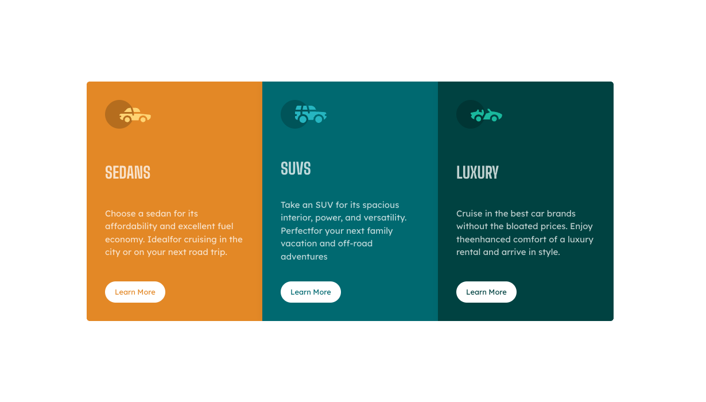

# 3-Column Preview Card Component

This is a solution to the [Frontend Mentor](https://www.frontendmentor.io/challenges/3column-preview-card-component-pH92eAR2-) **3-column preview card component** challenge.

## Demo

You can find the working [demo](https://furkanssarri-3-col-card.netlify.app/) here.

## Overview

A responsive card component built with React and CSS, featuring three columns for Sedans, SUVs, and Luxury cars. Each card displays an icon, title, description, and a call-to-action button with interactive hover states.

## Features

- Responsive design for desktop and mobile
- Custom fonts: Lexend Deca & Big Shoulders Display
- Elegant hover effects and box shadows
- Accessible and semantic markup

## Technologies Used

- React
- CSS (with custom properties and layers)
- Frontend Mentor assets

## Getting Started

1. Clone the repository
2. `bash npm install`
3. Run with your preferred development server

## Credits

- Challenge by [Frontend Mentor](https://www.frontendmentor.io)

---

Feel free to use this project as a portfolio piece or reference for similar card layouts!
